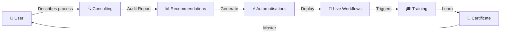

# 🚀 Fleece AI - Complete AI Automation Ecosystem

<div align="center">


**Transform your business with AI-powered automation from audit to deployment to training**

[](https://nextjs.org/)
[](https://pipedream.com/)
[](https://www.anthropic.com/)

</div>

---

## 🎯 What is Fleece AI?

Fleece AI is a **complete SaaS ecosystem** that combines three powerful AI-driven services to revolutionize how businesses implement automation:

### 🔍 **1. Fleece AI Consulting**
Your AI business process consultant that:
- Conducts comprehensive audits of your workflows
- Maps your current processes visually
- Identifies automation opportunities with AI
- Provides ROI estimates and implementation priorities

### ⚡ **2. Fleece AI Automatisations**
Transforms recommendations into reality by:
- Generating Pipedream workflows automatically with AI
- Connecting 2,500+ apps via OAuth (Gmail, Slack, Salesforce, etc.)
- Deploying workflows with one click
- Monitoring executions in real-time

### 🎓 **3. Fleece AI Training**
Ensures your team masters the automations through:
- AI-generated personalized training courses
- Interactive video lessons and modules
- Knowledge check quizzes
- Verified certificates and gamification

---

## 🔄 How It Works



### **Step-by-Step Flow:**

1. **📋 Audit** - Talk to the Consulting AI about your processes
2. **🎯 Identify** - AI detects automation opportunities
3. **🔧 Build** - Automatisations AI generates Pipedream workflows
4. **🔐 Connect** - OAuth connects your apps securely
5. **🚀 Deploy** - One-click deployment to production
6. **📚 Learn** - Training AI creates personalized courses
7. **🏆 Certify** - Complete modules and earn certificates

---

## ✨ Key Features

### 🤖 AI-Powered Everything
- **Claude 4.5 Sonnet** for expert consulting
- **GPT-4** for workflow generation
- **Gemini 2.5** for content creation
- Specialized AI prompts for each service

### 🔗 Massive Integration Library
- 2,500+ pre-built app integrations
- OAuth authentication built-in
- Real-time data synchronization
- Webhook support for custom triggers

### 📊 Comprehensive Analytics
- Workflow execution statistics
- Learning progress tracking
- ROI calculations
- Performance dashboards

### 🎮 Gamification
- Points and levels system
- Achievement badges
- Daily streaks
- Leaderboards (coming soon)

### 🏅 Certification System
- Auto-generated certificates
- Unique certificate numbers
- Verification URLs
- Professional PDF downloads

---

## 🛠️ Tech Stack

| Layer | Technology |
|-------|-----------|
| **Frontend** | Next.js 16, React 19, TypeScript, Tailwind CSS |
| **Backend** | Next.js API Routes, Serverless Functions |
| **Database** | PostgreSQL, Drizzle ORM |
| **Authentication** | NextAuth v5, Google OAuth |
| **AI** | Anthropic Claude, OpenAI GPT, Google Gemini |
| **Integrations** | Pipedream MCP, 2,500+ apps |
| **Deployment** | Vercel, Neon Serverless Postgres |

---

## 🚀 Quick Start

### Prerequisites

- Node.js 18+
- PostgreSQL database
- Pipedream account
- AI API keys (OpenAI, Anthropic, or Google)

### Installation

```bash
# Clone the repository
git clone <your-repo-url>
cd ai-automations-chat

# Install dependencies
pnpm install

# Set up environment variables
cp .env.example .env
# Edit .env with your credentials

# Run database migrations
pnpm db:migrate

# Start development server
pnpm dev
```

### Access Fleece AI

Open your browser and navigate to:
```
http://localhost:3000/fleece
```

---

## 📁 Project Structure

```
fleece-ai/
├── app/(chat)/
│   ├── fleece/                      # Main Fleece AI app
│   │   ├── page.tsx                # Dashboard
│   │   ├── consulting/            # Consulting service
│   │   ├── automations/           # Automatisations service
│   │   └── training/              # Training service
│   └── api/fleece/                # API routes
│       ├── consulting/
│       ├── automations/
│       └── training/
├── lib/
│   ├── db/
│   │   ├── schema.ts              # Extended schema
│   │   └── fleece-queries.ts      # Database queries
│   └── ai/
│       └── fleece-prompts.ts      # AI system prompts
└── FLEECE_AI_GUIDE.md            # Complete documentation
```

---

## 📖 Usage Examples

### Example 1: E-commerce Support Automation

**Consulting Phase:**
```
User: "We handle 500 support emails daily. It takes 2 hours to triage and assign them."

AI Audit:
✅ Process: Manual email triage
✅ Pain Point: Time-consuming, error-prone
✅ Opportunity: Automate with Gmail + CRM
✅ ROI: Save 10 hours/week
```

**Automatisations Phase:**
```
AI Generated Workflow:
Trigger: New email in support@company.com
Step 1: Extract customer info
Step 2: Check CRM for existing customer
Step 3: Categorize by keywords (refund, bug, question)
Step 4: Assign to correct team in Slack
Step 5: Create ticket in CRM
```

**Training Phase:**
```
Auto-generated Course:
Module 1: Understanding the workflow (5 min)
Module 2: Managing Gmail triggers (10 min)
Module 3: CRM integration (15 min)
Module 4: Slack notifications (10 min)
Quiz: 10 questions
Certificate: Support Automation Expert
```

---

## 🎯 Use Cases

- **Customer Support** - Automate ticket creation, assignment, and follow-ups
- **Sales** - Lead capture, qualification, and CRM updates
- **Marketing** - Campaign automation, social media posting, analytics
- **HR** - Onboarding workflows, time-off requests, employee surveys
- **Finance** - Invoice processing, expense approvals, reporting
- **Operations** - Inventory management, order processing, shipping

---

## 🔒 Security & Privacy

- ✅ Enterprise-grade authentication (NextAuth v5)
- ✅ Data encryption at rest and in transit
- ✅ User data isolation and ownership verification
- ✅ OAuth 2.0 for third-party app connections
- ✅ Audit logs for all operations
- ✅ GDPR compliant data handling

---

## 🌟 Roadmap

### Q1 2024
- [x] Core Consulting engine
- [x] Automatisations builder
- [x] Training LMS
- [x] Gamification system

### Q2 2024
- [ ] Visual workflow builder
- [ ] Team collaboration features
- [ ] Advanced analytics dashboard
- [ ] Mobile app (React Native)

### Q3 2024
- [ ] AI agents for autonomous operations
- [ ] Marketplace for pre-built workflows
- [ ] White-label solution
- [ ] Enterprise SSO

---

## 🤝 Contributing

We welcome contributions! See our [Contributing Guide](CONTRIBUTING.md) for details.

### Development Workflow

1. Fork the repository
2. Create a feature branch (`git checkout -b feature/amazing-feature`)
3. Commit your changes (`git commit -m 'Add amazing feature'`)
4. Push to the branch (`git push origin feature/amazing-feature`)
5. Open a Pull Request

---

## 📞 Support

- 📧 Email: support@fleeceai.com
- 💬 Discord: [Join our community](https://discord.gg/fleeceai)
- 📚 Docs: [docs.fleeceai.com](https://docs.fleeceai.com)
- 🐛 Issues: [GitHub Issues](https://github.com/your-repo/issues)

---

## 📜 License

This project is licensed under the MIT License - see the [LICENSE](LICENSE) file for details.

---

## 🙏 Acknowledgments

- **Pipedream** - For the incredible MCP integration platform
- **Anthropic** - For Claude AI that powers our consulting
- **Vercel** - For seamless deployment and hosting
- **Next.js Team** - For the amazing framework

---

<div align="center">

**Made with ❤️ by the Fleece AI Team**

[Website](https://fleeceai.com) • [Documentation](https://docs.fleeceai.com) • [Blog](https://blog.fleeceai.com)

⭐ Star us on GitHub if you find this useful!

</div>
